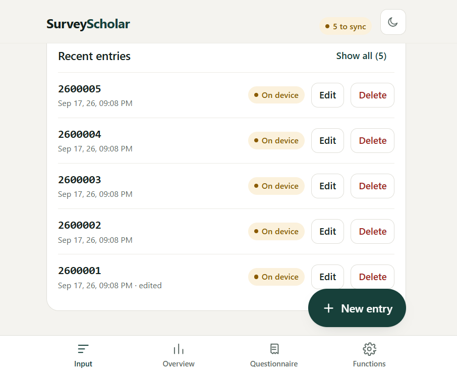
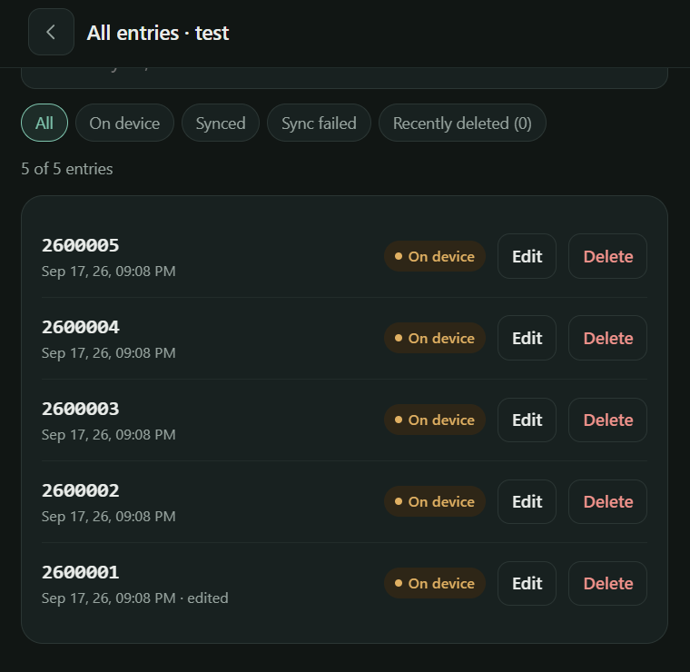
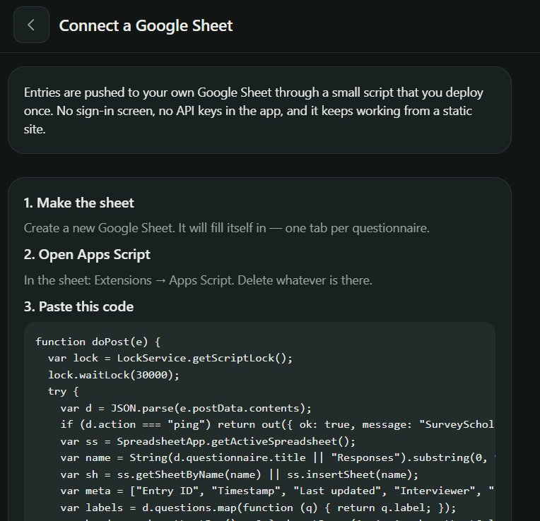
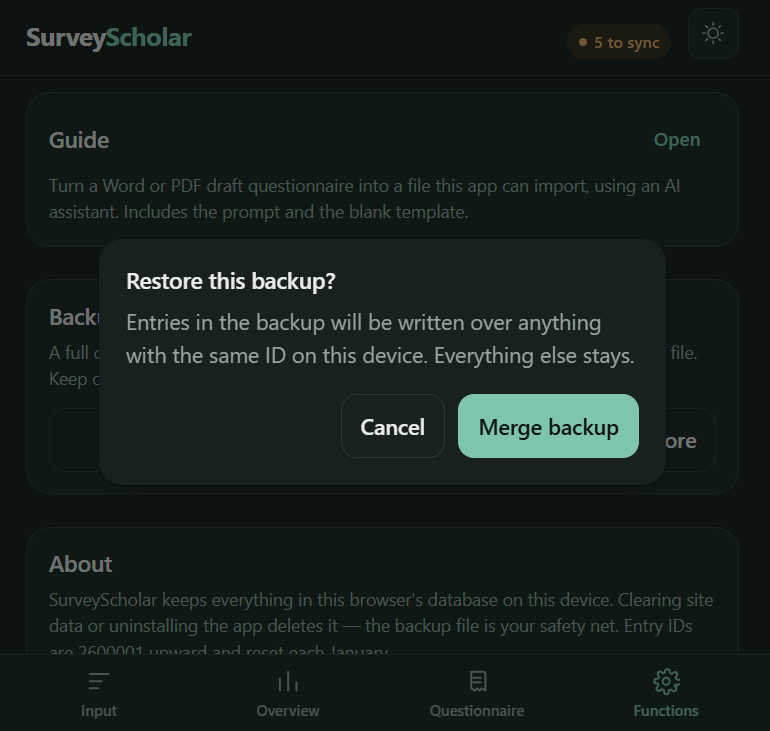

<div align="center">


# SurveyScholar

**offline-first field survey collection that fits in one HTML file**

[live demo](https://Mustofa-statcn.github.io/surveyscholar/) · [user guide](docs/user-guide.md) · [deploy it](docs/deployment.md) · [architecture](docs/architecture.md)

[](../../actions/workflows/deploy.yml)
[](../../actions/workflows/test.yml)
[](LICENSE)
[](#why-one-file)

</div>

SurveyScholar is a survey data collection app for people who do fieldwork where the
network doesn't reach. You build a questionnaire, hand the phone to yourself in a
village with no signal, collect entries all day, and push them to a Google Sheet when
you're back on wifi.

**The phone is the source of truth. Google Sheets is a mirror.** Every design decision
in this repo follows from that one sentence — nothing is ever deleted to make room for
a sync, nothing is marked "sent" without a confirmed reply, and no entry ID is ever
reused.

It is one `index.html` file. No bundler, no framework CLI, no `npm run build`, no
server of your own. Put it on GitHub Pages and it's done.


<div align="center">




<sub>Entries carry their own sequential IDs and a sync badge. “On device” is the normal state in the field.</sub>




<sub>The sheet setup guide ships inside the app. Restoring a backup merges by Entry ID — nothing else is touched.</sub>

</div>

## features

- **works with the radio off** — entry, editing, validation and export never touch the network
- **installs like an app** — PWA with a service worker; add to home screen, launches full-screen
- **sequential entry IDs** — `YY` + 5 digits, unique per year, generated inside a single IndexedDB transaction so concurrent saves can't collide
- **skip logic and sections** — conditional questions that can only point *backwards*, which makes cycles structurally impossible
- **form versioning** — old responses stay readable under the exact question list they were collected with
- **autosaving drafts** — 500 ms after every keystroke; refreshing mid-interview loses nothing
- **soft deletes** — a deleted entry keeps its row and its ID forever
- **idempotent sync** — rows are upserted on Entry ID, so retrying a failed sync is always safe
- **Excel & CSV export** — real `.xlsx` via SheetJS, one column per answerable question
- **import a questionnaire** — from a filled-in Excel template, or heuristically from a Word/PDF draft
- **full JSON backup / restore** — every questionnaire, entry and setting in one file
- **light, dark, or follow the device** — applied before first paint, no flash

## quick start

### 1. deploy the app

Fork this repo, then:

```
Settings → Pages → Source: GitHub Actions
```

The included workflow publishes the repo root on every push to `main`. Within a minute
your app is at `https://<your-username>.github.io/<repo>/`.

Prefer not to use Actions? Set Source to `Deploy from a branch`, branch `main`, folder
`/ (root)`. Both work — see [docs/deployment.md](docs/deployment.md).

> [!IMPORTANT]
> HTTPS is required. Service workers, and therefore offline mode, do not run over
> plain `http://`. GitHub Pages gives you HTTPS for free; if you host it yourself,
> you must too.

### 2. install it on the phone

Open the URL on the device you'll collect with, **while online**, so the app shell and
its four CDN libraries land in the cache. Then browser menu → *Add to Home screen*.
After that first visit it runs in airplane mode.

### 3. connect a Google Sheet (optional)

Sync is entirely optional — you can collect for months and only ever use Excel export.
If you do want a live sheet:

1. Open the Google Sheet you want filled → **Extensions → Apps Script**
2. Paste the contents of [`apps-script.gs`](apps-script.gs), replacing whatever's there
3. **Deploy → New deployment → Web app**, Execute as **Me**, Access **Anyone**
4. Copy the `/exec` URL into the app: **Functions → Web app URL → Save link → Test connection**

Full walkthrough with screenshots of every consent prompt:
[docs/google-sheets.md](docs/google-sheets.md).

### 4. build a questionnaire

Either tap **Questionnaire → New** and add questions by hand, or fill in the Excel
template (**Questionnaire → Import questionnaire → Download template**) and import it.
Column reference: [docs/questionnaire-format.md](docs/questionnaire-format.md).

## cautions

Read these before you collect data you can't collect again.

> [!WARNING]
> **Storage is per-browser, per-device, and the browser can evict it.**
> Everything lives in IndexedDB. Clearing site data, "clear browsing data", some
> storage-cleaner apps, and iOS's automatic eviction of unused sites will wipe it.
> **Take the JSON backup after every field day** (Functions → Download backup) and
> keep it somewhere that isn't the phone. Installing to the home screen and syncing
> regularly both make eviction much less likely, but neither is a guarantee.

> [!WARNING]
> **`Access: Anyone` on the Apps Script deployment means anyone with the URL can
> write to your sheet.** There is no authentication — that's the trade for having no
> OAuth consent screen and no client secret in a public static file. Treat the `/exec`
> URL as a password: don't commit it, don't put it in a screenshot, don't paste it in
> a group chat. If it leaks, redeploy to get a new one. Anyone who has it can append
> rows; they cannot read your other sheets or your Google account.

> [!CAUTION]
> **Deleting a questionnaire deletes its responses from the device.** The confirm
> dialog makes you type `DELETE` for a reason. Export or sync first.

Other limits worth knowing up front:

- **Photos never leave the device.** The sheet and the exports record `[photo]`; the
  image itself is only in the JSON backup. Budget for backup files being large.
- **Entry IDs are unique per device, not globally.** Two phones running SurveyScholar
  will both produce `2600001`. This is a single-interviewer tool by design — for a
  team, give each device a prefix (see [docs/architecture.md](docs/architecture.md) §8).
- **Document import (Word/PDF) needs one online session** to fetch the reader library.
  It's also a heuristic and will guess wrong sometimes; everything it guesses is
  flagged on the review screen before anything is saved.
- **Conditions compare answers as strings**, so `2` and `"2"` match. Deliberate —
  spreadsheet imports produce strings.
- **No bulk delete**, deliberately, so the confirm step stays meaningful.
- **Personal data is your responsibility.** SurveyScholar has no analytics, no
  trackers and no telemetry, and the developer never sees your data — but if you're
  collecting information about people, consent, ethics approval and local data
  protection law are on you. See [docs/privacy.md](docs/privacy.md).

## documentation

| Doc | What's in it |
|---|---|
| [user guide](docs/user-guide.md) | Every screen, every button, and the day-to-day fieldwork workflow |
| [deployment](docs/deployment.md) | GitHub Pages, custom domains, self-hosting, updating, cache busting |
| [Google Sheets sync](docs/google-sheets.md) | Apps Script setup, what each column means, sync failure modes |
| [questionnaire format](docs/questionnaire-format.md) | The Excel template, question types, skip logic rules |
| [architecture](docs/architecture.md) | Data model, invariants, how each subsystem works, how to extend it |
| [troubleshooting](docs/troubleshooting.md) | Symptom → cause → fix, including data recovery |
| [privacy & data handling](docs/privacy.md) | What's stored where, what leaves the device, GDPR-shaped notes |

## development

There is no build step. Open `index.html` in a browser and that's the app.

For the service worker and PWA install to behave, serve it over localhost rather than
`file://`:

```bash
python3 -m http.server 8000
# → http://localhost:8000
```

Tests run in Node — 60 data-layer tests and 37 UI tests that mount the real app in
jsdom and click through it:

```bash
npm install
npm test
```

Both suites read `index.html` directly and evaluate the real code. There is no second
copy of the logic to keep in sync, which is the entire reason the app is one file.

## why one file

| Choice | Instead of | Reason |
|---|---|---|
| React + `htm` from CDN | React + Vite | The repo *is* the deployable. No build, no lockfile drift, no "it works locally". |
| Plain IndexedDB | Dexie / `idb` | Entry-ID generation needs one transaction spanning two stores; writing it directly makes the atomicity inspectable. |
| Hand-written CSS | Tailwind | The Tailwind play CDN recompiles CSS on every launch — wrong trade on a field phone. |
| Apps Script web app | Google OAuth | No consent screen and no client secret sitting in a public static file. |
| SheetJS | own xlsx writer | Exports must open in real Excel. Not worth reinventing. |

The long version is in [docs/architecture.md](docs/architecture.md).

## contributing

Issues and pull requests are welcome. Please read
[CONTRIBUTING.md](CONTRIBUTING.md) first — it's short, but it explains the invariants
that the tests defend and that a PR must not break.

If you're reporting a bug that lost or corrupted data, say so plainly in the title.
Those get looked at first.

## security

Found something that could expose collected data? Don't open a public issue —
see [SECURITY.md](SECURITY.md).

## license

[MIT](LICENSE). Do what you like with it, including using it in paid research work.
No warranty — this software is used to collect data that is often expensive and
sometimes impossible to collect twice, and you are responsible for your own backups.
